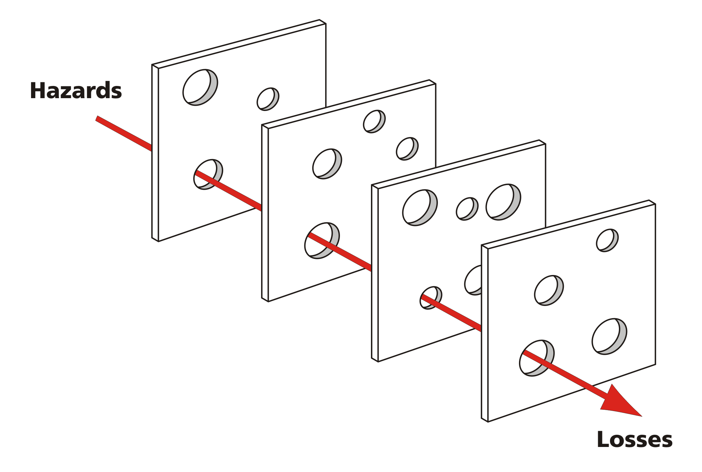

#### 案例背景：某化工企业反应釜清洗化学灼伤事故

现场情景描述：
某夜班期间，反应釜（属于受限空间/PRCS）由于上一批次物料残留，需要紧急进行人工刷洗。工艺技术员乙临时口头安排了一名刚入职2个月的外包操作工甲进入釜内作业。由于平时配发的长袖耐酸碱橡胶手套太厚、不好抓握刷子，甲私自换成了自己购买的普通劳保纱手套。作业期间，清洗剂（强酸性）透过纱手套长时间接触皮肤，导致甲右手及前臂发生严重化学灼伤。

<!--more-->

#### 某化工企业的调查与处理结果：  

- 员工乙没有申请作业许可，没有履行安全职责，即要求作业人员进行作业。
- 员工甲安全意识淡薄，私自更换不合格的PPE。  
- 培训不到位，员工对不清楚各自的权利与义务。  
- 处理建议： 处罚员工甲、乙，警告外包公司，重新组织全员安全培训。  

在很多企业的事故调查报告中，我们经常会看到以上的报告，这些报告的共同点就是：  

**原因分析：“员工安全意识淡薄”、“现场违章作业”、“安全培训不到位”。  
整改措施：“考核罚款”、“重新组织全员培训”、“要求员工签字承诺”。**

这种被称为**责罚与培训**的传统模式，只关注了冰山浮出水面的最底端——员工的个体行为，却放过了隐匿在水面之下的组织系统缺陷。

结果就是：同样的事故，换一个员工，在几个月后依然会重复发生。

接下来，文章将使用瑞士奶酪模型（Swiss Cheese Model），并结合OSHA的屏障防御思维，通过这起典型的反应釜清洗灼伤事故，演示如何从“追究个人责任”升级为“发现系统漏洞”，完成一次深入的根因分析（RCA）。  

##### 瑞士奶酪模型  

